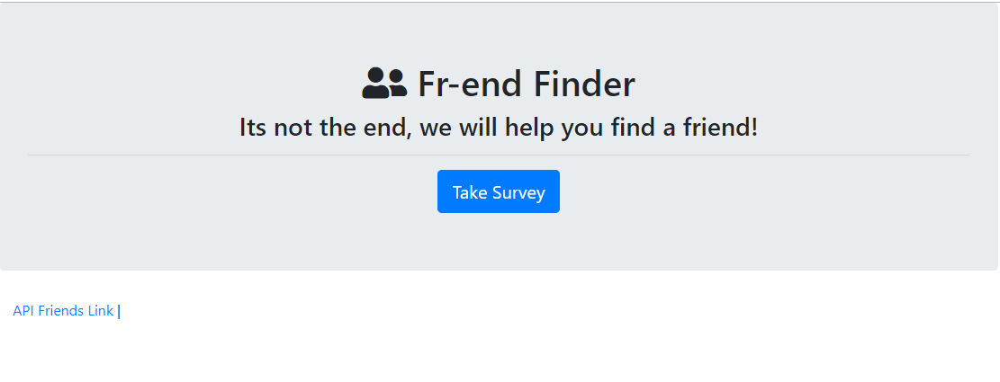

# Friend-Finder
This short 10 question survey will help you find a friend!

# Go check it out for yourself
* Link to the live app [Heroku](https://fr-end-finder.herokuapp.com/)

## Description
Friend Finder implements friend matching based on the user's responses to a ten question survey. The user responds to questions with values from 1 (Strongly Disagree) to 5 (Strongly Agree). When the survey is submitted, an existing user record closest to the current user's responses is found and returned. The closest set of user responses is defined as the set with the lowest absolute difference for all ten questions combined.

Friend Finder application is meant to simulate a simple dating app. The application is implemented using a Node.js and Express server on the back end and the Bootstrap CSS framework on the front end.
## Instructions
*   Go to the homepage and click on the survey button. This will bring you to a page that contains a form. Please fill out
your name and a link to a photo of your choice. Answer the 10 questions and let our app do the rest. 
A popup will show you the match that we came up with. 

## Technologies Used
* JavaScript
* jQuery
* node.js
* Express.js
* HTML
* Bootstrap